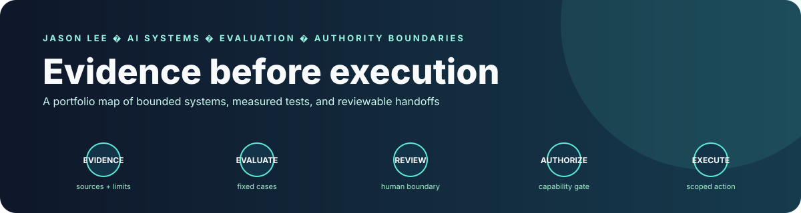
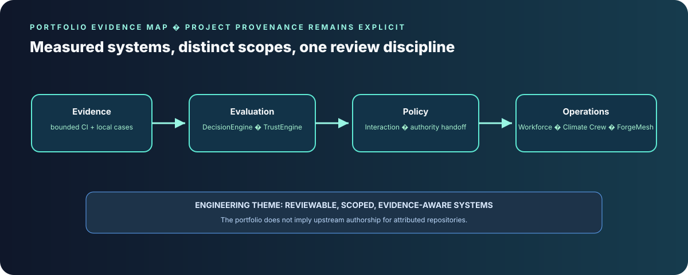

  

<h1 align="center">Jason Lee</h1>

<strong>AI Systems Developer · Agent Reliability & Evaluation · Titan Zero</strong>

Melbourne, Australia · <a href="mailto:jason@titanzero.io">jason@titanzero.io</a>

BSc, Environmental Chemistry major — Griffith University (2015) · MBA — Australian Institute of Business (2018)

I build AI-enabled software where model suggestions meet evidence, evaluation, and clear authority boundaries. My environmental chemistry background informs how I handle uncertainty, provenance, and reproducibility.

<strong>Target roles:</strong> AI Systems Engineer · Applied AI Engineer · Agent Reliability / Evaluation Engineer  
<strong>Primary:</strong> TypeScript / Node.js · <strong>Growth area:</strong> Python · PHP / Laravel project experience

## Measured test evidence

Three reference-engine evaluations completed successfully in GitHub Actions on 4 October 2026:

- **[Titan Decision Engine · 260 cases](https://github.com/Masterleeaus/decision-engine/actions/runs/37175696976):** 0/177 blocked or unresolved cases produced an unsafe ready handoff; 0/83 valid recommendations were wrongly blocked; 0/42 wrong-company attempts created a request; and 0/260 dispatch-contract violations occurred. A recommendation-only baseline treated 175/177 blocked or unresolved cases as actionable. The evaluation covers the Step 27 reference handoff, not host persistence, approval, revalidation, or execution. [Method and report](https://github.com/Masterleeaus/decision-engine#reproducible-authority-handoff-evaluation).
- **[Titan Interaction Engine · 31 cases](https://github.com/Masterleeaus/Interaction-engine/actions/runs/37171514412):** 0/24 blocked requests were allowed (95% Wilson upper bound: **13.8%**); 0/7 valid requests were wrongly denied; 0/1 cross-tenant approval attempts passed. The test covers policy decisions, not adapters or downstream execution. [Method and report](https://github.com/Masterleeaus/Interaction-engine#reproducible-authority-policy-evaluation).
- **[Titan Trust Engine · 32 cases](https://github.com/Masterleeaus/Trust-Engine/actions/runs/37176074419):** 0/32 trust-level mismatches, 0/32 quality-flag mismatches, and 0/32 scenario failures. The cases also expose a limitation: all 3 GPS-present cases with missing accuracy still receive a high signal while carrying the `no_accuracy` flag. GPS does not prove attendance, identity, or truth. [Method and report](https://github.com/Masterleeaus/Trust-Engine#reproducible-trust-signal-evaluation).

These are small, bounded suites. The intervals describe the synthetic test counts; they are not estimates of production risk or proof of production readiness.

### Local verification

**Decision Engine · local run, 4 Oct 2026 · Node 24.19.0 · unpinned checkout:** 16/16 test files for Steps 10–25 passed after TypeScript compilation; 33/33 tests for Steps 26–30 passed. This was a local run, not CI, and its source commit was not recorded. [Reference-engine source and tests](https://github.com/Masterleeaus/decision-engine/tree/main/engines).

## Repository audit register

The current portfolio-wide maintenance and manual-fix register is tracked in [PORTFOLIO_REPO_FIXES.md](PORTFOLIO_REPO_FIXES.md). It separates completed fixes from CI reruns, architecture decisions, environment-dependent verification, licensing/provenance review, and branding work.

## Engineering focus

- **Agent workflows:** keep model interpretation, recommendations, approval, and execution as separate stages.
- **Evaluation:** use fixed scenarios, baselines, failure counts, and explicit test limits.
- **Operational software:** build scoped APIs and offline-capable workflows with reviewable state changes.

## Current Titan product naming

The commercial Titan suite is currently organised as:

| Product | Role | Brand colour |
| --- | --- | --- |
| **Titan Zero** | Primary conversational day-to-day AI experience | Neutral / suite identity |
| **Titan Core** | System administration, configuration and suite management | Neutral / platform identity |
| **Titan Build** | Growth, launch and new-business / new-vertical capabilities | Blue |
| **Titan Desk** | Customer, sales, communications and front-office operations | Red |
| **Titan Field** | Scheduling, dispatch, field execution and operational standards | Yellow |
| **Titan Pay** | Payments, invoicing, reconciliation and money workflows | Green |

Historical repository names are retained where they represent separate engineering experiments or earlier product generations; current commercial naming should use the table above.

## Selected projects

  

| Project | Work |
| --- | --- |
| [Titan Decision Engine](https://github.com/Masterleeaus/decision-engine) | TypeScript reference engines for evidence, constraints, uncertainty, recommendations, and capability-gated handoff. |
| [Titan Interaction Engine](https://github.com/Masterleeaus/Interaction-engine) | Tenant-scoped interaction workflows and separately evaluated policy decisions. |
| [Titan Trust Engine](https://github.com/Masterleeaus/Trust-Engine) | PHP/Laravel evidence assurance, readiness signals, and human review workflows. |
| [Titan Field](https://github.com/Masterleeaus/Titan-Zero-Field-Service-Workforce) | Company-scoped field operations, offline work, and governed execution. |
| [Climate Crew](https://github.com/Masterleeaus/Climate-crew) | Python research-platform prototype for climate and environmental investigation. |
| [ForgeMesh](https://github.com/Masterleeaus/ForgeMesh) | Repository intelligence for composing task-specific AI engineering teams. |

## Work in progress

- **LLM-in-the-loop evaluation:** [Merged PR #2](https://github.com/Masterleeaus/decision-engine/pull/2) adds a 200-case synthetic proposer-to-gate harness. The [offline CI smoke check](https://github.com/Masterleeaus/decision-engine/actions/runs/37174873332) passed; a live-model evaluation has not run yet.
- **Titan Field local checks:** a developer-local record lists 31/31 focused checks on temporary overlays. The tested implementation is unpublished and clean-checkout reproduction is pending, so this is development evidence rather than a public CI result. [Details and limits](https://github.com/Masterleeaus/Titan-Zero-Field-Service-Workforce/blob/main/docs/working/2026-10-04-local-test-evidence.md).
- **Climate Crew:** remains a prototype; I have not published a reproduced scientific result yet.

## Delivery example

[PR #1201](https://github.com/Masterleeaus/Titan-Zero-Field-Service-Workforce/pull/1201) is an agent-assisted merge covering authenticated runtime composition, durable recovery, and company-scoped execution. Its record lists exact-head tests and leaves live-host commissioning unverified.
